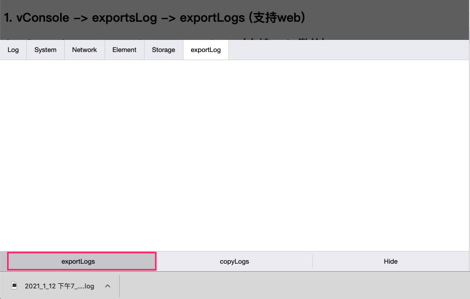
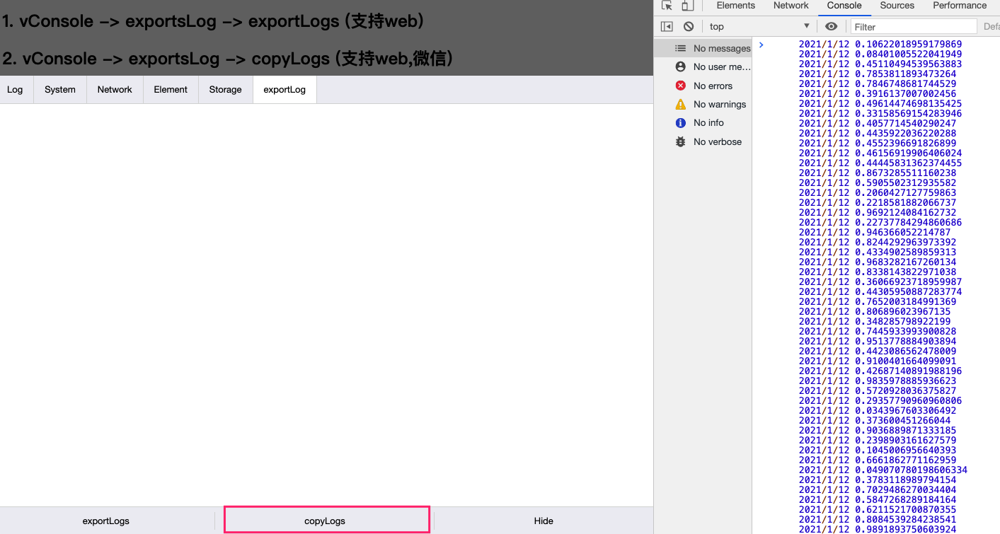

# vconsole-outputlog-plugin
依赖于[vConsole](https://github.com/Tencent/vConsole)
使用该插件可以复制或下载console中打印的log

`output logs file and copy logs in vConsole Environment.`


## 安装
```
npm install vconsole-outputlog-plugin
```
## 引入

```html
  const vConsole = new VConsole();
  const plugin = new VConsoleOutputLogsPlugin(vConsole);
```

## 图示

> 下载(web)


> 复制到剪贴板
